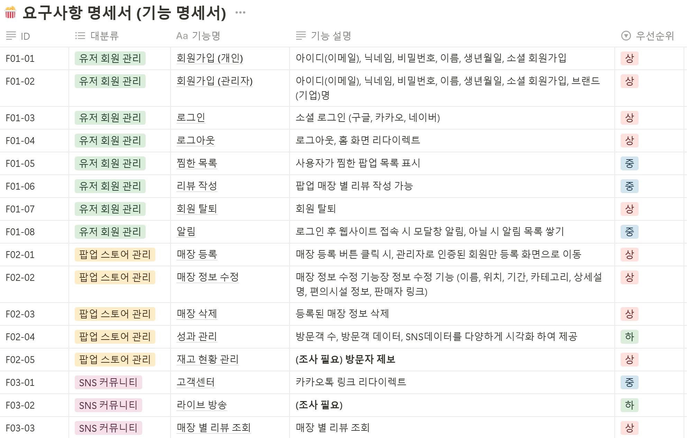

| **날짜** | **전체** | **김동욱** | **김윤지** | **김정모** | **나용성** | **이상혁** | **정민규** |
| --- | --- | --- | --- | --- | --- | --- | --- |
| 01/13 | 프로젝트 주제 회의, 컨설턴트+코치 1차 사전 미팅 | 컨설턴트 + 코치 미팅전 아이디어 보완,React 학습 | 컨설턴트, 코치 미팅 전 아이디어 보완, React 학습 | 컨설팅 미팅 전 아이디어 보완, Docker 학습 | 선정된 아이디어 보완, 컨설턴트+코치 미팅 전 대비, JIRA 세팅, SPRING 학습 | React 학습 | 팀 미팅 전 아이디어 보완, 자바 및 스프링 학습 |
| 01/14 | 개인 별 아이디어 조사 및 공유 | 개별 아이디어 기획 및 발표, git 학습 | 아이디어 기획 및 회의 | 아이디어 기획 및 회의 | 아이디어 기획 및 회의 | 아이디어 회의 및 발표 | 아이디어 기획 및 구체화, 아이디어 자료조사 |
| 01/15 | 아이디어 기획 | 아이디어 회의,팀 아이디어 기능 구체화 | 아이디어 기획 및 구체화, 아이디어 회의 | 아이디어 회의, 기획 및 구체화 | 아이디어 회의, 아이디어 구체화 | 아이디어 회의 및 자료조사 | 아이디어 기획 및 구체화, 아이디어 자료조사 |
| 01/16 | 아이디어 기획 | 아이디어 회의, 자료조사 | 아이디어 회의 및 구체화, 아이디어 자료조사 | 아이디어 회의, 기획 및 구체화 | 아이디어 기획, JIRA 스프린트 생성 | 아이디어 회의 및 자료조사 | 아이디어 기획 및 구체화, 아이디어 자료조사 |
| 01/17 | 아이디어 구체화 | 아이디어 구체화 ( 기능 명세), 자료조사, 서비스 흐름도 생각 | 아이디어 회의 및 구체화, 아이디어 자료조사 | 아이디어 구체화및 자료 조사, 상호 평가 | 아이디어 구체화 (기능 명세), 자료조사, README 업데이트 | 기능 구체화, 자료조사, 상호 평가 | 아이디어 구체화, 상호 평가, 자료조사 |